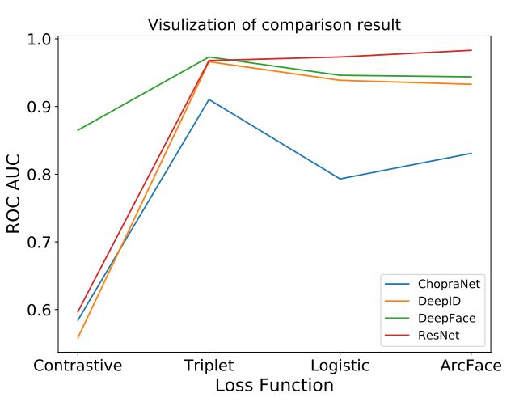

# MLP-Siamese-Network
Investigate Siamese Network for Face Verification

## CNN Backbone

### ChopraNet

### DeepID 

### DeepFace

### ResNet-50

## Result

## To Do
**CNN Backbone** 

- [x] ChopraNet (Baseline)
- [x] DeepID v1 
- [x] DeepFace 
- [x] ResNet50 https://github.com/pytorch/vision/blob/master/torchvision/models/resnet.py
- [x] Xception https://github.com/Cadene/pretrained-models.pytorch/blob/master/pretrainedmodels/models/xception.py

**Loss Function**

- [x] Contrastive Loss
- [x] Triplet Loss
- [x] Logistic Loss
- [x] CosFace Loss 
- [x] ArcFace Loss 

**Engineering** 

- [x] GPU server configuration - Google Cloud Computing
- [x] Evaluation Metric - ROC-AUC
- [x] Implement locally connected layer
- [x] Learning rate shceduler (Cosine Annealing)
- [x] Batch normalization
- [x] Data augmentation (Random Horizontal Flip)

